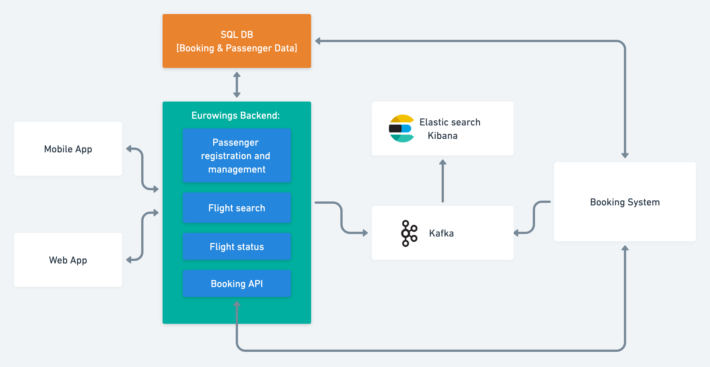
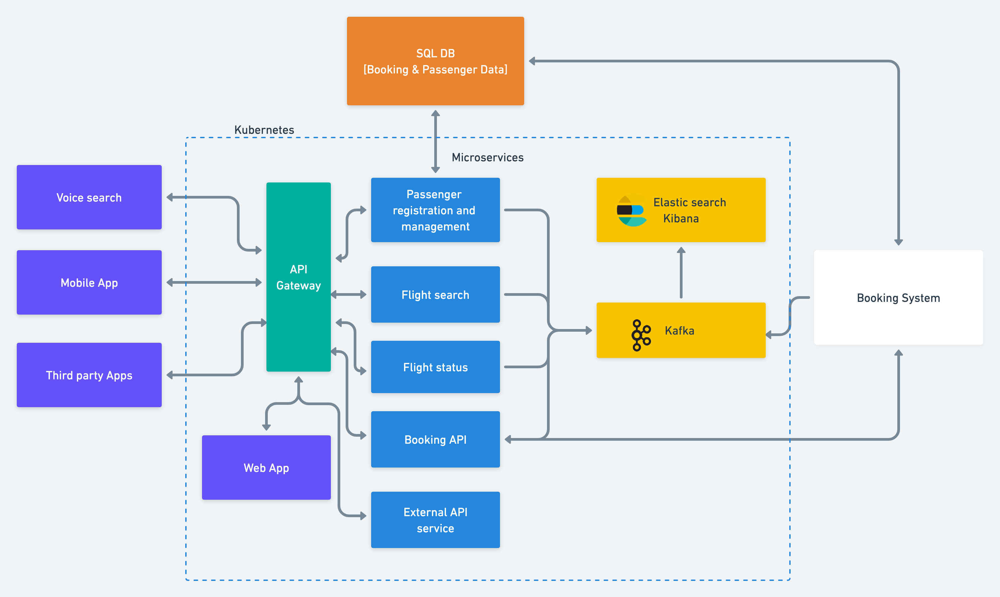

## A. Current architecture
 

## B & C. Proposed microservice architecture

Here the idea is to break up the monolithic application into microservices, but want to keep the booking functionality as a monolithic component. 
This is a common approach when dealing with large legacy systems - rather than attempting to rewrite the entire system at once, 
it can be more practical to break it up into smaller, more manageable pieces and migrate them to a microservices architecture incrementally.

One way to approach this would be to create separate microservices for each major functional area of the application (e.g. passenger management, flight search, flight status etc.), 
and then have them all communicate with the clients and each other via its API. 
This would allow us to update and maintain each microservice independently, while still making use of the existing booking functionality.

We could then use a data streaming platform, such as Apache Kafka, to collect event data from the various microservices and send it to our central Elasticsearch/Kibana system for analysis. 
This would allow us to get a comprehensive view of what is happening across the entire system, 
without having to worry about the complexity of the individual microservices.

## D. How do you plan the roll-out of the new architecture on production?

There are a few key steps we can follow when rolling out a new microservices architecture to production:

1. **Start small:** Rather than trying to migrate your entire monolithic application to microservices at once,
start with a small, self-contained piece of functionality and build from there. 
This will allow you to get a feel for the challenges and benefits of working with microservices, 
and give you a chance to refine your approach as you go.

2. **Implement proper testing and monitoring:** When working with microservices, 
it is important to have a robust testing and monitoring strategy in place to ensure that each service is working as intended 
and that any issues are caught and addressed quickly. 
This can include unit tests, integration tests, and end-to-end tests, as well as monitoring tools to track performance, errors, and other key metrics.

3. **Use a CI/CD pipeline:** A CI/CD pipeline can help to automate the process of building, testing, and deploying the microservices,
making it easier to roll out updates and new features on a regular basis.
This can include tools like  Jenkins or CircleCI and automatic quality checks using tools like SonarQube.

4. **Plan for failures:** No matter how well we test and monitor the microservices, 
there will always be a chance of failure. It is important to plan for this by implementing robust error handling and failover mechanisms, 
and by having a solid plan in place for how to quickly recover from failures when they do occur.

5. **Communicate and coordinate with the team:** When working with microservices, 
it is important to have clear communication and coordination among team members to ensure that everyone is on the same page and working towards the same goals.
This can include regular meetings, progress updates, and a well-defined workflow and process for developing and deploying new features.

## E. Which frameworks and technologies would you use to implement your architecture? 

There are many frameworks and technologies that could be used to implement a microservices architecture,
and the best choice will depend on our specific requirements and constraints. 
Some options to consider might include:

1. **Programming languages:** Java, Typescript, and Go are all popular choices for building microservices.
2. **Frameworks:** Spring Boot and Quarkus for Java. NestJS, Express or Fastify for Typescript. Gin and Gorilla for Go.

3. **Data streaming and Analytics:** Apache Kafka is a popular choice for collecting and streaming data from microservices, thanks to its high performance and ability to handle large volumes of data. 
Elasticsearch and Kibana are popular choices for data analytics and visualization.
4. **API gateways:** API gateways can be used to provide a single point of entry for all of the microservices, popular options include Kong, Tyk, and Apigee.
5. **CI/CD tools:** Jenkins, CircleCI, and Gitlab CI/CD are good choices for CI/CD pipelines. For Gitops we could use ArgoCD or FluxCD.
6. **Containerization:** Using containers to package and deploy your microservices can make it easier to manage their dependencies and scale them as needed.
Containers managed by Kubernetes is now the de facto standard for container orchestration, but other options to consider is Amazon ECS.

7. **Deployment platforms:** Platforms like AWS, Azure, and Google Cloud offer a range of tools and services that can make it easier to deploy and manage microservices in the cloud. 
These can include managed container services, serverless functions, and other tools that can help, build and deploy microservices more quickly and efficiently.

