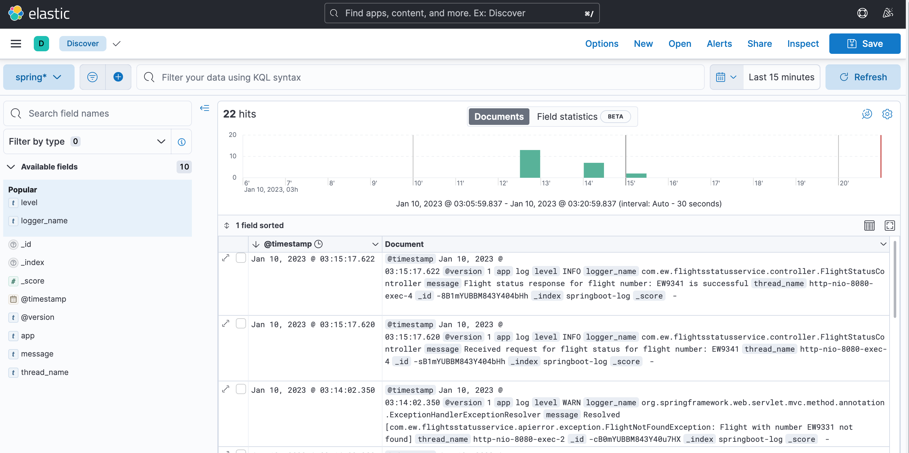

## A. flights-status-service
This application is created using Java and Spring Boot. 
To run this application, check-out this git repository and run the following commands:

```mvn spring-boot:run```

The application will be available at http://localhost:8080

The openapi documentation is available at http://localhost:8080/swagger-ui/index.html

The api offers one endpoint to get the status of a flight.

Example request:

``` 
curl -X 'GET' \
  'http://localhost:8080/flights/status?flightNumber=EW9081' \
  -H 'accept: */*'
  ```

and the response will look like this: 
    
```json
{
"flight_iata": "EW9081",
"dep_time": "2023-01-11 08:40",
"dep_estimated": null,
"dep_actual": null,
"arr_time": "2023-01-11 10:00",
"arr_estimated": null,
"arr_actual": null,
"status": "scheduled",
"duration": "80",
"delayed": null,
"dep_delayed": null,
"arr_delayed": null,
"updated": "1673384876",
"dep_name": "Munich International Airport",
"dep_city": "Munich",
"dep_country": "DE",
"arr_name": "Duesseldorf International Airport",
"arr_city": "Düsseldorf",
"arr_country": "DE",
"airline_name": "Eurowings"
}
```

Incase the flight number is not found, the response will look like this:

```json
{
  "statusCode": 404,
  "message": "Flight with number EW90819 not found",
  "description": "uri=/flights/status",
  "timestamp": "2023-01-11T02:05:40.368+00:00"
}
```

To build the docker image:

```mvn compile jib:dockerBuild```

This will build a docker image named: _flights-status-service_

_Note: For convinience the api key of the external api is hardcoded in the application.properties file. This is not a good practice and should be avoided in production._

## B. ElasticSearch and Kibana
To run ElasticSearch and Kibana, run the following commands:

```docker-compose up```

The Kibana dashboard will be available at http://localhost:5601/

The Spring boot application will publish the logs to Elasticsearch through Logstash.

To view the logs in Kibana, go to the Kibana dashboard and click on the "Discover" tab.

To run the whole application a second docker compose file named, docker-compose-all.yml is provided. 
To run it:

```docker-compose -f docker-compose-all.yml up```

An example Kibana dashboard is given below: 




